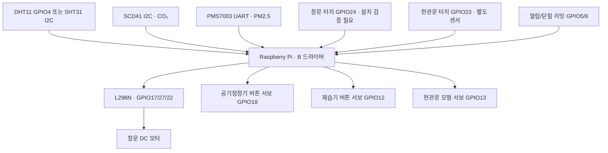
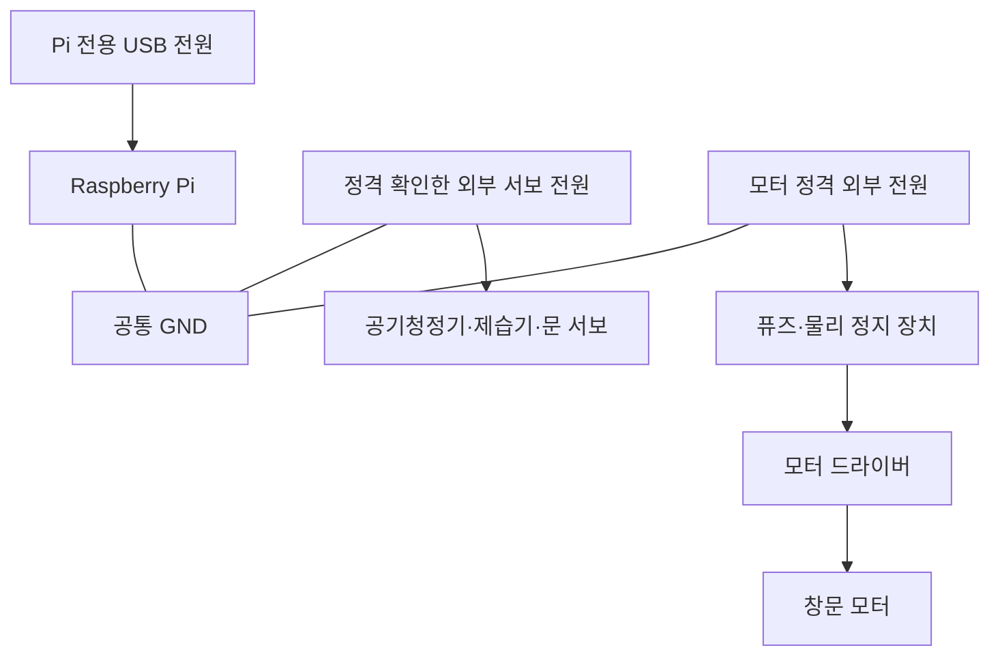

# B 하드웨어 구성도·전체 배선·기구 제작

## 1. 신호 구성

터치로 닫힘/열림을 추정하는 모니터링과 모터의 끝점 리밋은 역할이 다릅니다.
창문 모터가 없으면 터치센서만으로 모니터링할 수 있습니다.
DHT11과 SHT31 중 한 종류를 온습도 측정 소스로 선택합니다.

## 2. 전원 구성

- 외부 전원의 +를 Pi 3.3V/5V에 연결하지 않습니다. GND만 공통으로 연결합니다.
- 모터/서보 전류는 브레드보드 가는 점퍼선을 경유하지 않고 정격 배선/단자대로 분배합니다.
- L298N 보드의 `ENA` 점퍼를 제거해야 GPIO22로 제어할 수 있습니다.
  `5V-EN`은 다른 점퍼입니다. 보드 설명서의 로직 전원 조건에 맞춰 설정하고
  L298N 5V 출력과 Pi 5V를 묶지 않습니다. 모든 L298N 모듈의 레귤레이터 구성이 같지 않습니다.
- L298N의 전압 강하/발열 및 모터 정지전류를 확인합니다. 모터 정격을 초과하면 적합한 드라이버로 교체합니다.
- 부팅·프로세스 강제 종료에도 출력이 안전하게 되도록 ENA 하드웨어 풀다운/전원 정지 장치를 설계합니다.
- 코드의 소프트웨어 리밋/타임아웃은 끼임 감지 장치가 아닙니다. 실물 창문에는
  적합한 역회전 허용 리밋 회로와 장애물/전류 감지, 수동 해제 장치가 추가로 필요합니다.
  코드의 `obstruction` 콜백은 연결 지점이며, 센서를 자동으로 제공하지 않습니다.

## 3. 핀 대응표

BCM(GPIO 번호)와 물리(헤더 위치) 번호를 함께 적었습니다. 40핀 Pi 헤더 기준입니다.

| 장치 | 장치 핀 | BCM | 물리 핀 | 전원/주의 |
|---|---|---:|---:|---|
| DHT11/22 모듈 | DATA | 4 | 7 | VCC 3.3V, GND |
| SHT31 / SCD41 브레이크아웃 | SDA | 2 | 3 | 3.3V 신호 지원 보드 사용 |
| SHT31 / SCD41 브레이크아웃 | SCL | 3 | 5 | 공통 버스, 주소 0x44 / 0x62 |
| PMS7003 어댑터 | TX → Pi RX | 15 | 10 | 센서 VCC 5V, UART 3.3V |
| PMS7003 어댑터 | RX ← Pi TX | 14 | 8 | 현재 active read는 TX→RX만 필요, 명령용 선택 |
| 창문 터치 | OUT | 24 | 18 | VCC 3.3V, GND |
| 현관문 터치 | OUT | 23 | 16 | 창문과 별개 장치 |
| L298N | IN1 | 17 | 11 | 열림 방향 시험 |
| L298N | IN2 | 27 | 13 | 닫힘 방향 시험 |
| L298N | ENA | 22 | 15 | ENA 점퍼 제거 |
| 열림 끝점 스위치 | NO → GPIO, COM → GND | 5 | 29 | 내부 풀업, 눌림 LOW |
| 닫힘 끝점 스위치 | NO → GPIO, COM → GND | 6 | 31 | 내부 풀업, 눌림 LOW |
| 공기청정기 버튼 서보 | Signal | 18 | 12 | 외부 정격 전원 |
| 제습기 버튼 서보 | Signal | 12 | 32 | 외부 정격 전원 |
| 현관문 모형 서보 | Signal | 13 | 33 | 외부 정격 전원 |
| 3.3V 센서 전원 | VCC | — | 1 또는 17 | GPIO 출력과 구별 |
| PMS 전원 | VCC | — | 2 또는 4 (5V) | Pi 전원 공급 여유 확인 |
| 공통 접지 | GND | — | 6 등 | 신호 기준점 |

PMS7003의 작은 커넥터는 전용 케이블/핀도 확인 후 어댑터 기능명으로 연결합니다.
제조사 모듈 핀 배열을 선 색만 보고 추측하지 않습니다. SCD41은 센서 단품 대신
해당 전압에서 사용 가능한 브레이크아웃을 기준으로 합니다.
Pi5 등의 UART 장치 경로는 실제 `ls -l /dev/serial*`와 보드 문서로 확인하고
필요하면 `RoomSensorReader(pms_port="실제 경로")`로 지정합니다.

## 4. 창문 Retrofit 제작 순서

1. 창문 종류(미닫이/여닫이), 이동 거리, 이동 힘을 실측합니다. 기존 창문을 손으로 움직일 수 있어야 합니다.
2. 모터/리니어 액추에이터의 정격, 스트로크, 정지전류를 선정합니다. 수치는 현장 실측 후 확정합니다.
3. 클램프/탈부착 브래킷과 수동 분리 기구를 먼저 제작합니다. 임대 창틀에 비가역 가공하지 않는 형태를 우선합니다.
4. 모터를 창문에서 분리한 상태로 정·역방향을 확인합니다.
5. 두 리밋을 끝점 **직전**에 작동하도록 설치합니다. GPIO 입력을 먼저 확인합니다.
6. 낮은 속도에서 개폐 시험, 리밋 미작동 시험, 비상정지를 시험합니다.
7. `timeout`을 실제 정상 이동시간보다 여유 있게 조정하되 불필요하게 길게 두지 않습니다.
8. 장애물 검출·하드웨어 정지·수동 해제를 검증한 뒤 기구를 결합합니다.

코드: 같은 목표 반복은 이동시간을 연장하지 않습니다. 역방향 전환은 정지 후 기본 0.1초 대기합니다.
두 리밋 동시 입력·시간 초과·장애물 입력은 `fault`가 유지되며 자동 재시작하지 않습니다.
원인을 점검한 뒤 `reset_fault()`를 호출합니다. `close()`는 모터를 정지합니다.

## 5. 가전 버튼 Retrofit 제작

1. 가전 전원 버튼이 기계식/정전식인지, 짧게 눌러 켜짐/꺼짐이 토글되는지 확인합니다.
2. 브래킷으로 서보를 고정하고 부드러운 누름 팁을 붙입니다.
3. 기구를 분리해 `rest_angle`, `press_angle`을 조절합니다. 기구가 끝까지 막혀 서보가 버티지 않게 합니다.
4. 실제 버튼에서 `press_seconds`, `settle_seconds`를 조정합니다.
5. 전원 LED/전류 등 상태 피드백을 추가하는 것이 권장됩니다. `feedback=lambda: bool_or_none`으로 주입합니다.
6. 피드백이 없으면 눈으로 확인한 현재 상태를 `initially_on`/`confirm_state()`로 알려줍니다.
   그 이후 수동으로 버튼을 누르면 소프트웨어 추정이 틀릴 수 있으므로 재확인이 필요합니다.

공기청정기와 제습기를 같은 드라이버 기반으로 지원하되 서로 다른 GPIO를 씁니다.
명령 중에 목표가 바뀌어도 동시에 두 번 누르지 않습니다. 실제 버튼 인식에 실패할 수 있으므로
피드백 없는 `on/off`는 추정 상태이며 장치가 켜졌다는 실물 검증을 대신하지 않습니다.
가전의 AC 전원 배선을 개조하는 작업은 이 구현 범위에 포함하지 않습니다.

## 6. 현관문 모형 제작

별도 터치/위치 센서(GPIO23)로 닫힘을 확인하고 서보(GPIO13)로 닫는 동작만 지원합니다.
문 무게와 레버 길이로 토크를 선정합니다. 실제 방화문/현관문에 소형 서보만 붙여
자동 닫기 안전성이 확보되었다고 판단하지 않습니다. 출입·수동 개방을 막지 않는 모형부터 시험합니다.

`DoorAutoCloser`는 연속 열림 600초 후 최대 3회 시도하는 **단독 실습 정책**입니다.
클라우드 승인/재실 판단/알림 정책은 C/A/D 범위입니다. 두 자동제어를 동시에 켜지 않습니다.
닫힘 피드백이 없으면 성공으로 기록하지 않고, 최대 횟수 이후 멈춥니다.
`stop()`은 정책을 해제하며, 이미 진행 중인 서보도 멈추려면 `closer.close()`를 호출합니다.

## 7. 확인한 기술 자료

- Raspberry Pi 공식 GPIO/하드웨어: https://www.raspberrypi.com/documentation/computers/raspberry-pi.html
- gpiozero 출력·서보·모터 API: https://gpiozero.readthedocs.io/en/stable/api_output.html
- DHT 예제: https://docs.circuitpython.org/projects/dht/en/latest/examples.html
- SCD4x API: https://docs.circuitpython.org/projects/scd4x/en/latest/api.html
- DFR0030 제조사: https://wiki.dfrobot.com/dfr0030/

문서의 배선은 기능명 기준 설계이며, 부품 모델/핀 표시/전원 정격 확인을 대체하지 않습니다.
